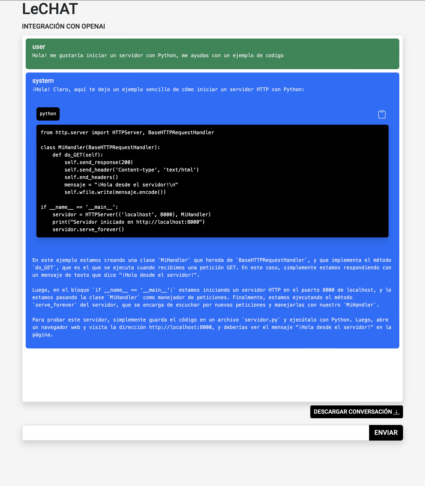

# Prueba de concepto API openai

Integración de openai y de una ventana estilo "chat" para enviar mensajes y recibir respuesta de chatGpt usando el modelo **gpt-3.5-turbo**

Algunas funcionalidades:

- scroll automático para mostrar siempre el ultimo mensaje
- incorporación de bootstrap
- incorporación de interprete para el codigo enviado como respuesta desde openai
- se puede descargar la conversación en txt
- se pueden copiar los "codigos" sugeridos

## Instalación

```bash
git clone
cd openai-chat
npm install
```

## Configurar

Copiamos y agregamos el id de la api key de openai en el archivo .env

```bash
cp .env.example .env
```

## Uso

```bash
npm start
```

## Captura


